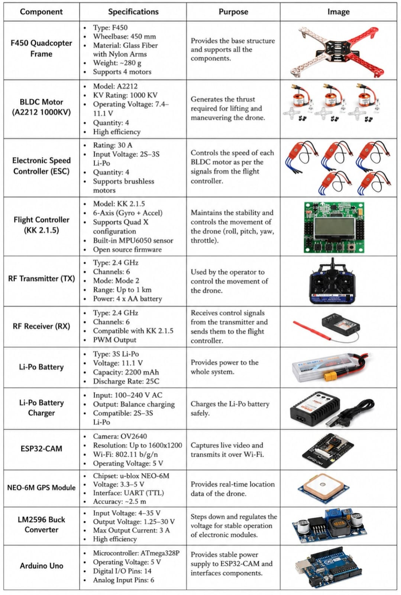
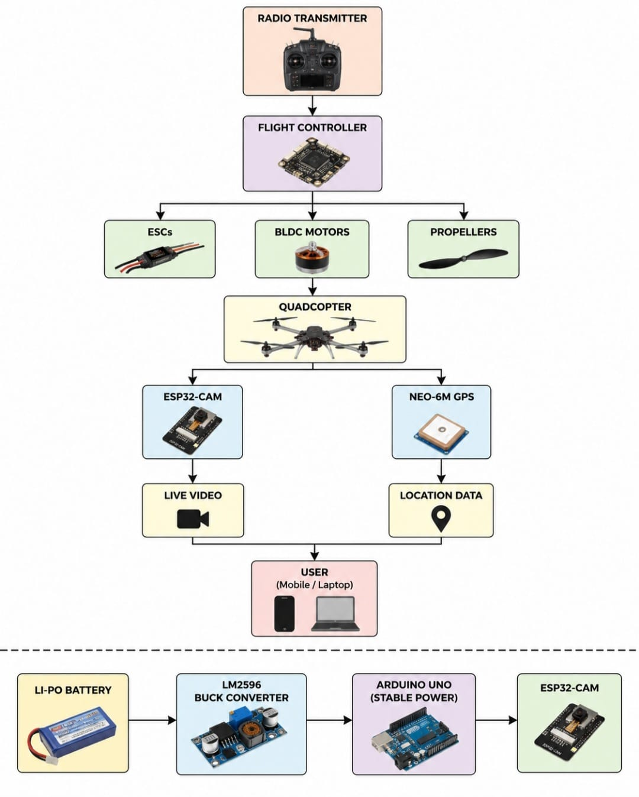
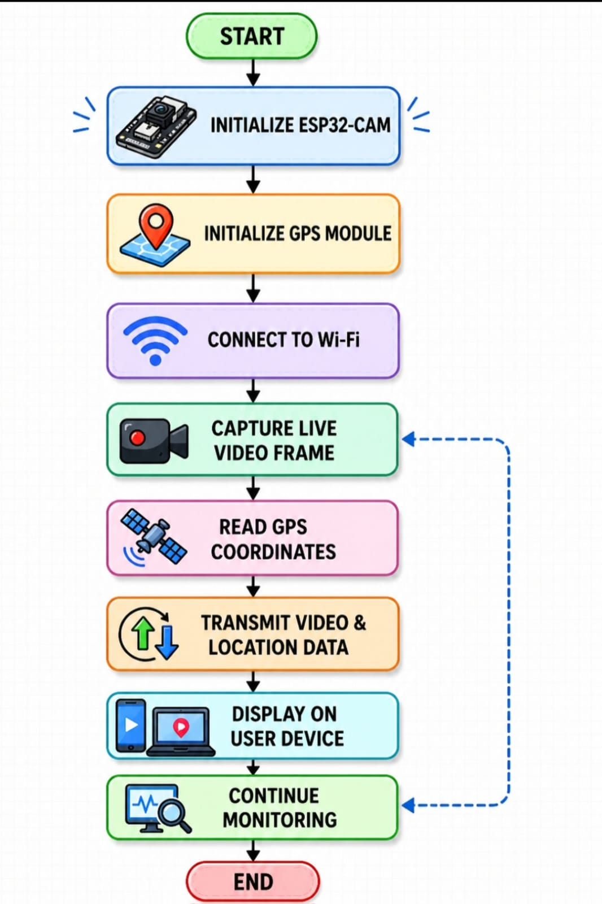
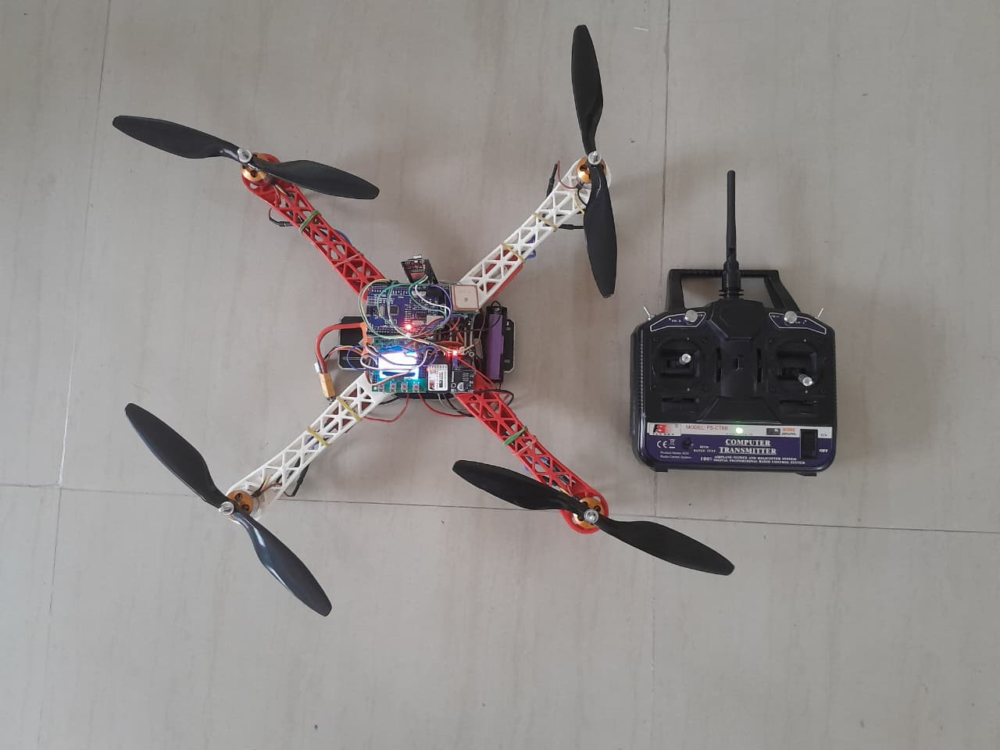
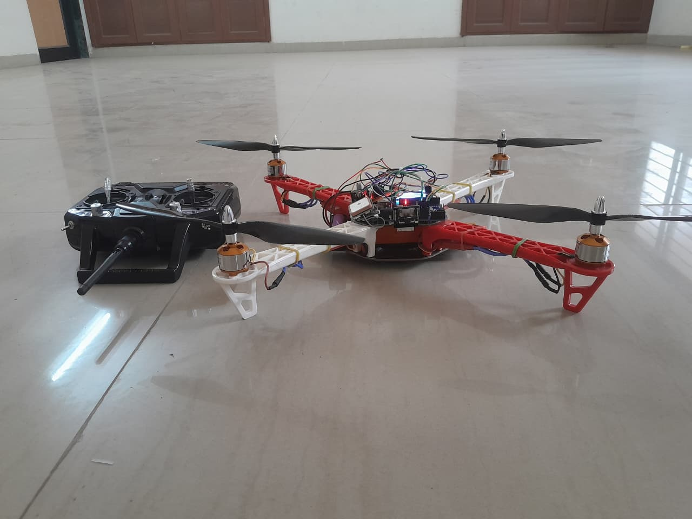

# 🚁 Aerial Surveillance Drone using ESP32-CAM and NEO-6M GPS


## ⭐ Project Overview

An IoT-based **Aerial Surveillance Drone** developed to demonstrate **real-time wireless video streaming** and **GPS-based location tracking** using an **ESP32-CAM** and **NEO-6M GPS module**.

The project integrates a quadcopter platform with an onboard camera and GPS module, enabling users to monitor the surrounding environment through a live video feed while simultaneously viewing the drone's real-time location. The integrated software provides a web-based interface containing the live camera stream and a GPS location button. When a valid GPS fix is available, the interface displays the latitude, longitude, and a direct Google Maps link.

This project was developed to explore the integration of embedded systems, wireless communication, IoT, and drone technology for surveillance applications.

---

## ⭐ Project Highlights

- ✔️ Live video streaming using ESP32-CAM over Wi-Fi
- ✔️ Real-time GPS location tracking using NEO-6M
- ✔️ Web interface combining the camera stream and GPS location
- ✔️ Latitude and longitude display with direct Google Maps integration
- ✔️ Flight control using KK2.1.5 Flight Controller
- ✔️ Stable power supply using LM2596 Buck Converter and Arduino Uno
- ✔️ Modular software architecture with separate camera testing and integrated system code
- ✔️ Prototype successfully demonstrated with flight, live camera streaming, and GPS location tracking

---

## 🎯 Project Objectives

The primary objectives of this project are:

- Develop a quadcopter capable of performing basic aerial surveillance.
- Implement real-time live video streaming using the ESP32-CAM module.
- Integrate the NEO-6M GPS module to provide the drone's current geographical location.
- Develop a web-based interface to display the live camera stream and GPS coordinates.
- Enable users to locate the drone through direct Google Maps integration.
- Gain practical experience in integrating embedded hardware, wireless communication, and IoT technologies into a complete working system.

---

## 🛠 Hardware Components

| Component | Purpose |
|-----------|---------|
| F450 Quadcopter Frame | Drone chassis and structural support |
| A2212 1000KV BLDC Motors (×4) | Generate thrust for flight |
| 30A ESCs (×4) | Control motor speed |
| KK2.1.5 Flight Controller | Flight stabilization and control |
| FS-CT6B Transmitter & Receiver | Wireless flight control |
| ESP32-CAM | Live video streaming over Wi-Fi |
| NEO-6M GPS Module | Real-time location tracking |
| Arduino Uno | Provides a stable 5 V power supply to the surveillance modules |
| LM2596 Buck Converter | Voltage regulation |
| 3S Li-Po Battery | Power source for the drone |

### Hardware Components Overview

<p align="center">
  
</p>

---

## 🏗️ System Architecture

The Aerial Surveillance Drone consists of two major subsystems:

- **Flight Control System** – Responsible for maintaining stable flight and controlling the drone's movement.
- **Surveillance System** – Responsible for live video streaming and real-time GPS tracking.

The RF transmitter sends control commands to the KK2.1.5 Flight Controller, which stabilizes the quadcopter and controls the BLDC motors through the Electronic Speed Controllers (ESCs). An ESP32-CAM mounted on the drone captures live video and streams it wirelessly over Wi-Fi. Simultaneously, the NEO-6M GPS module continuously acquires the drone's geographical coordinates. The ESP32-CAM receives this GPS data through UART and provides the latitude, longitude, and Google Maps link through the same web interface used for live camera streaming.

---

### System Block Diagram

<p align="center">
  
</p>

---

## ⚙️ Software Workflow

The software initializes the ESP32-CAM and NEO-6M GPS module before connecting to the configured Wi-Fi network. After connection, the ESP32-CAM starts a local web server and continuously provides the live camera stream. The GPS data is decoded using TinyGPS++, and when the user selects the location button, the interface displays the available latitude, longitude, and Google Maps link.

### Software Flowchart

<p align="center">
  
</p>

---

## ⚙️ Working Principle

The complete working of the Aerial Surveillance Drone is described below:

1. The drone is powered using a **3S Li-Po battery**, while the **LM2596 Buck Converter** and **Arduino Uno** provide a stable power supply to the ESP32-CAM and NEO-6M GPS module.

2. The **KK2.1.5 Flight Controller** receives control signals from the **FS-CT6B Transmitter and Receiver** and stabilizes the drone by controlling the speed of the four BLDC motors through the ESCs.

3. Once powered, the **ESP32-CAM** initializes the camera module, connects to the configured Wi-Fi network, and starts a web server for live video streaming.

4. Simultaneously, the **NEO-6M GPS module** continuously receives satellite signals and provides the drone's real-time geographical coordinates to the ESP32-CAM.

5. The integrated web interface provides:
   - Live video streaming from the ESP32-CAM
   - A button to request the current GPS location
   - Latitude and longitude with six-decimal precision
   - A direct Google Maps link
   - A notification when a valid GPS fix is not available

6. A user connected to the same Wi-Fi network can open the ESP32-CAM IP address in a web browser, view the live camera stream, and request the drone's available GPS location.

This integration enables the drone to perform basic aerial surveillance while providing location information for monitoring and tracking purposes.

---

## 📸 Project Demonstration

### Drone Prototype

<p align="center">
  
  
</p>

The developed prototype integrates the flight control system, ESP32-CAM module, NEO-6M GPS module, Arduino Uno, and LM2596 Buck Converter on an F450 quadcopter frame. The prototype was successfully assembled and tested to demonstrate stable flight, live video streaming, and GPS-based location tracking.

---

## 🎥 Demonstration Videos

### 🚁 Flight Demonstration

The drone was successfully tested for take-off, hovering, and controlled flight to verify the stability of the quadcopter platform.

📹 **Flight Demonstration**

[View Flight Demonstration](Videos/Flight_Demonstration.mp4)

---

### 📷 ESP32-CAM Live Stream Demonstration

The ESP32-CAM mounted underneath the drone captures a live downward-facing aerial view and streams it wirelessly over Wi-Fi through the onboard web server.

📹 **Camera Stream Demonstration**

[View Camera Stream Demonstration](Videos/Camera_Stream_Demonstration.mp4)

---

### 📍 GPS Location Demonstration

The NEO-6M GPS module obtains the geographical location of the drone. The latitude and longitude can be opened in Google Maps for location visualization.

📹 **GPS Demonstration**

[View GPS Demonstration](Videos/GPS_Demonstration.mp4)

---


## 💻 Software and Technologies Used

### Programming Language
- Arduino (C/C++)

### Development Environment
- Arduino IDE

### Hardware Modules
- ESP32-CAM
- NEO-6M GPS Module
- Arduino Uno
- KK2.1.5 Flight Controller

### Libraries
- esp_camera
- WiFi
- WebServer
- TinyGPS++
- HardwareSerial

---

## ✨ Key Features

- Live wireless video streaming using ESP32-CAM
- Real-time GPS location tracking
- Integrated web interface for camera streaming and GPS location
- Google Maps location integration
- Stable quadcopter flight using KK2.1.5 Flight Controller
- Modular software architecture
- Portable aerial surveillance prototype

---

## 📚 Learning Outcomes

Through this project, I gained practical experience in:

- Drone hardware assembly and integration
- Working with the ESP32-CAM and NEO-6M GPS module
- Basic wireless video streaming
- Prototype testing and debugging
- Understanding the integration of multiple embedded hardware modules

---

## 📂 Repository Structure

```text

---
Aerial-Surveillance-Drone/
│
├── Hardware/
│   ├── Block_diagram.png
│   ├── Components_Used.png
│   └── Software_Flowchart.png
│
├── Images/
│   ├── Drone_Prototype_1.png
│   └── Drone_Prototype_2.jpg
│
├── Software/
│   ├── Camera_Test/
│   │   └── CameraWebServer.ino
│   │
│   └── Final_Integrated_System/
│       └── ESP32_CAM_GPS_System.ino
│
├── Videos/
│   ├── Flight_Demonstration.mp4
│   ├── Camera_Stream_Demonstration.mp4
│   └── GPS_Demonstration.mp4
│
├── README.md
└── LICENSE

```

### Repository Contents

- **Hardware/** – Contains the system block diagram, software flowchart, and detailed overview of the hardware components used.
- **Images/** – Contains photographs of the developed drone prototype.
- **Software/** – Contains the ESP32-CAM camera test program and the final integrated camera and GPS program.
- **Videos/** – Contains the drone flight, ESP32-CAM live streaming, and GPS location demonstrations.
- **README.md** – Provides complete documentation of the project, its architecture, working, software, and demonstrations.
- **LICENSE** – Contains the MIT License for the repository.

---

## 🚀 Future Improvements

Possible future improvements include:

- Improve camera streaming performance and reduce latency.
- Enhance GPS tracking accuracy and dashboard functionality.
- Optimize power management for longer flight time.

---

## 🙏 Acknowledgements

This project was developed as part of my academic learning in Electronics and Communication Engineering.

I sincerely thank my college, faculty members, and mentors for their continuous guidance, encouragement, and support throughout the development of this project.

---

## 👩‍💻 Author

**Pooja Bhavsar**

Electronics and Communication Engineering Student

Interested in VLSI,  Embedded Systems, and Digital Design.

---

## 📄 License

This project is licensed under the MIT License.

See the LICENSE file for more details.

